### Questions
* is this a topic where i will have to google most of the time? 
    * yes

### Objectives
YWBAT 
* build a box plot
* build histograms
* build and interpret violin plots
* add vlines and hlines to boost visualizations
* make subplots longform
* make subplots with a for loop

### Outline
* questions
* load in some data or create data
* plotting everything


### Keyterms
* \*args -> arguments
* \*\*kwargs -> keyword argument
    * named parameter/argument


```python
import pandas as pd
import numpy as np

from sklearn.datasets import load_boston

from pprint import pprint

import matplotlib.pyplot as plt
import matplotlib
import seaborn as sns

matplotlib.rcParams['font.size'] = 12
```


```python
def myfunction(*args, **kwargs):
    for a in args:
        print(a)
    
    print("printing kwargs")
    print(type(kwargs))
    for k in kwargs:
        print(k)
        print(kwargs[k])
    pass
```


```python
myfunction(['a', 1, 2], 3, {"b": 2}, kw="this is an argument", kw2="another one")
```

    ['a', 1, 2]
    3
    {'b': 2}
    printing kwargs
    <class 'dict'>
    kw
    this is an argument
    kw2
    another one


```python
boston = load_boston()
```


```python
data = boston.data
columns = list(boston.feature_names) + ['target']
target = boston.target
```


```python
df = pd.DataFrame(np.column_stack((data, target)), columns=columns)
df.head()
```


<div>
<style scoped>
    .dataframe tbody tr th:only-of-type {
        vertical-align: middle;
    }

    .dataframe tbody tr th {
        vertical-align: top;
    }

    .dataframe thead th {
        text-align: right;
    }
</style>
<table border="1" class="dataframe">
  <thead>
    <tr style="text-align: right;">
      <th></th>
      <th>CRIM</th>
      <th>ZN</th>
      <th>INDUS</th>
      <th>CHAS</th>
      <th>NOX</th>
      <th>RM</th>
      <th>AGE</th>
      <th>DIS</th>
      <th>RAD</th>
      <th>TAX</th>
      <th>PTRATIO</th>
      <th>B</th>
      <th>LSTAT</th>
      <th>target</th>
    </tr>
  </thead>
  <tbody>
    <tr>
      <td>0</td>
      <td>0.00632</td>
      <td>18.0</td>
      <td>2.31</td>
      <td>0.0</td>
      <td>0.538</td>
      <td>6.575</td>
      <td>65.2</td>
      <td>4.0900</td>
      <td>1.0</td>
      <td>296.0</td>
      <td>15.3</td>
      <td>396.90</td>
      <td>4.98</td>
      <td>24.0</td>
    </tr>
    <tr>
      <td>1</td>
      <td>0.02731</td>
      <td>0.0</td>
      <td>7.07</td>
      <td>0.0</td>
      <td>0.469</td>
      <td>6.421</td>
      <td>78.9</td>
      <td>4.9671</td>
      <td>2.0</td>
      <td>242.0</td>
      <td>17.8</td>
      <td>396.90</td>
      <td>9.14</td>
      <td>21.6</td>
    </tr>
    <tr>
      <td>2</td>
      <td>0.02729</td>
      <td>0.0</td>
      <td>7.07</td>
      <td>0.0</td>
      <td>0.469</td>
      <td>7.185</td>
      <td>61.1</td>
      <td>4.9671</td>
      <td>2.0</td>
      <td>242.0</td>
      <td>17.8</td>
      <td>392.83</td>
      <td>4.03</td>
      <td>34.7</td>
    </tr>
    <tr>
      <td>3</td>
      <td>0.03237</td>
      <td>0.0</td>
      <td>2.18</td>
      <td>0.0</td>
      <td>0.458</td>
      <td>6.998</td>
      <td>45.8</td>
      <td>6.0622</td>
      <td>3.0</td>
      <td>222.0</td>
      <td>18.7</td>
      <td>394.63</td>
      <td>2.94</td>
      <td>33.4</td>
    </tr>
    <tr>
      <td>4</td>
      <td>0.06905</td>
      <td>0.0</td>
      <td>2.18</td>
      <td>0.0</td>
      <td>0.458</td>
      <td>7.147</td>
      <td>54.2</td>
      <td>6.0622</td>
      <td>3.0</td>
      <td>222.0</td>
      <td>18.7</td>
      <td>396.90</td>
      <td>5.33</td>
      <td>36.2</td>
    </tr>
  </tbody>
</table>
</div>


```python
df['target'].plot(kind='hist', figsize=(8, 5), fontsize=14)
plt.title("Target", fontsize=14)
plt.ylabel("Frequency", fontsize=14)
plt.show()
```


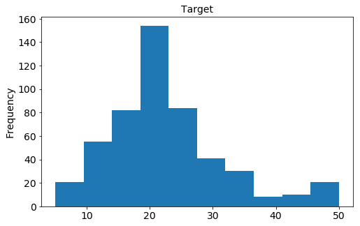


### Feature Engineering
* Create features from your data
* Make new data from existing data


```python
# let's make some categories for age
plt.hist(df.AGE, bins=20, alpha=0.5)
plt.title('AGE')
plt.show()

display(df.AGE.describe())
```


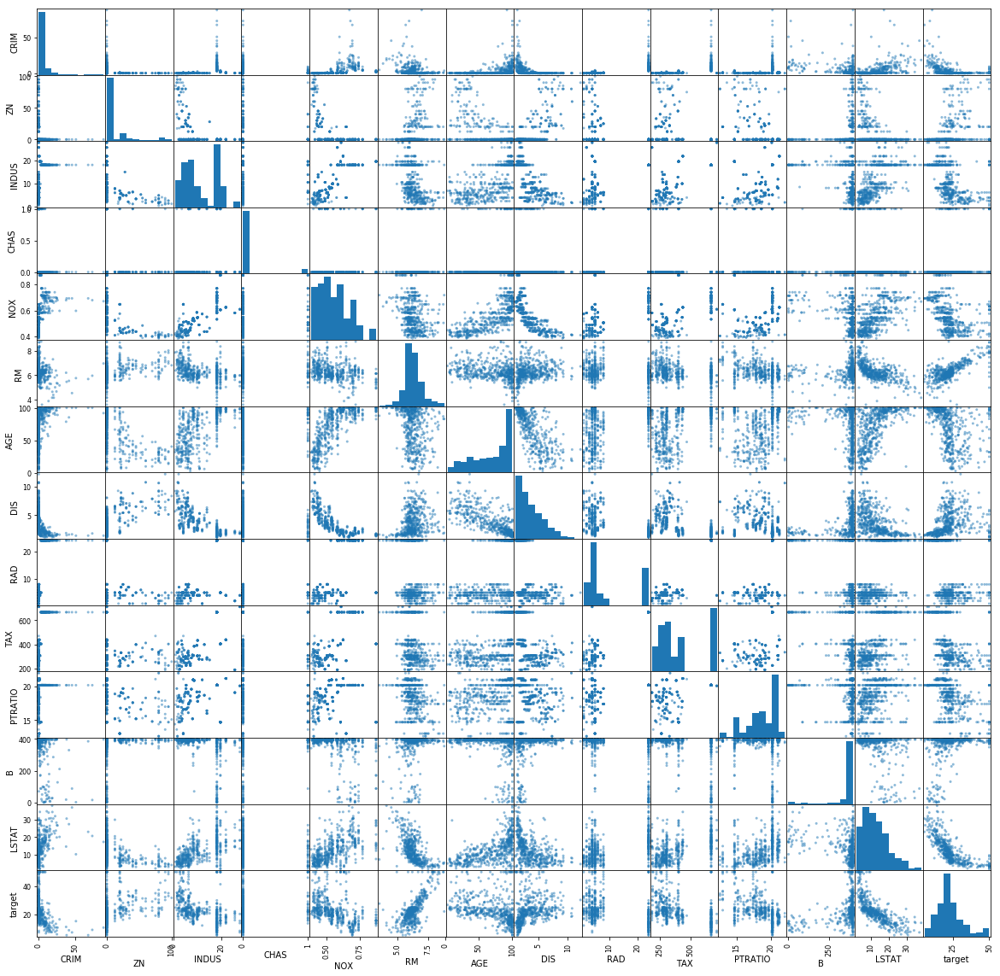


    count    506.000000
    mean      68.574901
    std       28.148861
    min        2.900000
    25%       45.025000
    50%       77.500000
    75%       94.075000
    max      100.000000
    Name: AGE, dtype: float64


```python
age_categories = []

for age in df["AGE"]:
    if age <= 45:
        age_categories.append("young")
    elif age <=94:
        age_categories.append("medium")
    else:
        age_categories.append("old")

df['age_categories'] = age_categories
```


```python
df.age_categories.value_counts().plot(kind='bar')
plt.title("Age Categories")
plt.show()
```


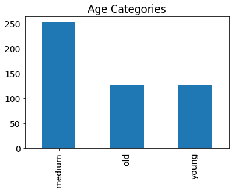


```python
df['dis_to_nox'] = df['DIS'] / df['NOX']
df.head()
```


<div>
<style scoped>
    .dataframe tbody tr th:only-of-type {
        vertical-align: middle;
    }

    .dataframe tbody tr th {
        vertical-align: top;
    }

    .dataframe thead th {
        text-align: right;
    }
</style>
<table border="1" class="dataframe">
  <thead>
    <tr style="text-align: right;">
      <th></th>
      <th>CRIM</th>
      <th>ZN</th>
      <th>INDUS</th>
      <th>CHAS</th>
      <th>NOX</th>
      <th>RM</th>
      <th>AGE</th>
      <th>DIS</th>
      <th>RAD</th>
      <th>TAX</th>
      <th>PTRATIO</th>
      <th>B</th>
      <th>LSTAT</th>
      <th>target</th>
      <th>age_categories</th>
      <th>dis_to_nox</th>
    </tr>
  </thead>
  <tbody>
    <tr>
      <td>0</td>
      <td>0.00632</td>
      <td>18.0</td>
      <td>2.31</td>
      <td>0.0</td>
      <td>0.538</td>
      <td>6.575</td>
      <td>65.2</td>
      <td>4.0900</td>
      <td>1.0</td>
      <td>296.0</td>
      <td>15.3</td>
      <td>396.90</td>
      <td>4.98</td>
      <td>24.0</td>
      <td>medium</td>
      <td>7.602230</td>
    </tr>
    <tr>
      <td>1</td>
      <td>0.02731</td>
      <td>0.0</td>
      <td>7.07</td>
      <td>0.0</td>
      <td>0.469</td>
      <td>6.421</td>
      <td>78.9</td>
      <td>4.9671</td>
      <td>2.0</td>
      <td>242.0</td>
      <td>17.8</td>
      <td>396.90</td>
      <td>9.14</td>
      <td>21.6</td>
      <td>medium</td>
      <td>10.590832</td>
    </tr>
    <tr>
      <td>2</td>
      <td>0.02729</td>
      <td>0.0</td>
      <td>7.07</td>
      <td>0.0</td>
      <td>0.469</td>
      <td>7.185</td>
      <td>61.1</td>
      <td>4.9671</td>
      <td>2.0</td>
      <td>242.0</td>
      <td>17.8</td>
      <td>392.83</td>
      <td>4.03</td>
      <td>34.7</td>
      <td>medium</td>
      <td>10.590832</td>
    </tr>
    <tr>
      <td>3</td>
      <td>0.03237</td>
      <td>0.0</td>
      <td>2.18</td>
      <td>0.0</td>
      <td>0.458</td>
      <td>6.998</td>
      <td>45.8</td>
      <td>6.0622</td>
      <td>3.0</td>
      <td>222.0</td>
      <td>18.7</td>
      <td>394.63</td>
      <td>2.94</td>
      <td>33.4</td>
      <td>medium</td>
      <td>13.236245</td>
    </tr>
    <tr>
      <td>4</td>
      <td>0.06905</td>
      <td>0.0</td>
      <td>2.18</td>
      <td>0.0</td>
      <td>0.458</td>
      <td>7.147</td>
      <td>54.2</td>
      <td>6.0622</td>
      <td>3.0</td>
      <td>222.0</td>
      <td>18.7</td>
      <td>396.90</td>
      <td>5.33</td>
      <td>36.2</td>
      <td>medium</td>
      <td>13.236245</td>
    </tr>
  </tbody>
</table>
</div>


```python
# let's look at a description of the data
print(boston.DESCR)
```

    .. _boston_dataset:
    
    Boston house prices dataset
    ---------------------------
    
    **Data Set Characteristics:**  
    
        :Number of Instances: 506 
    
        :Number of Attributes: 13 numeric/categorical predictive. Median Value (attribute 14) is usually the target.
    
        :Attribute Information (in order):
            - CRIM     per capita crime rate by town
            - ZN       proportion of residential land zoned for lots over 25,000 sq.ft.
            - INDUS    proportion of non-retail business acres per town
            - CHAS     Charles River dummy variable (= 1 if tract bounds river; 0 otherwise)
            - NOX      nitric oxides concentration (parts per 10 million)
            - RM       average number of rooms per dwelling
            - AGE      proportion of owner-occupied units built prior to 1940
            - DIS      weighted distances to five Boston employment centres
            - RAD      index of accessibility to radial highways
            - TAX      full-value property-tax rate per $10,000
            - PTRATIO  pupil-teacher ratio by town
            - B        1000(Bk - 0.63)^2 where Bk is the proportion of blacks by town
            - LSTAT    % lower status of the population
            - MEDV     Median value of owner-occupied homes in $1000's
    
        :Missing Attribute Values: None
    
        :Creator: Harrison, D. and Rubinfeld, D.L.
    
    This is a copy of UCI ML housing dataset.
    https://archive.ics.uci.edu/ml/machine-learning-databases/housing/
    
    
    This dataset was taken from the StatLib library which is maintained at Carnegie Mellon University.
    
    The Boston house-price data of Harrison, D. and Rubinfeld, D.L. 'Hedonic
    prices and the demand for clean air', J. Environ. Economics & Management,
    vol.5, 81-102, 1978.   Used in Belsley, Kuh & Welsch, 'Regression diagnostics
    ...', Wiley, 1980.   N.B. Various transformations are used in the table on
    pages 244-261 of the latter.
    
    The Boston house-price data has been used in many machine learning papers that address regression
    problems.   
         
    .. topic:: References
    
       - Belsley, Kuh & Welsch, 'Regression diagnostics: Identifying Influential Data and Sources of Collinearity', Wiley, 1980. 244-261.
       - Quinlan,R. (1993). Combining Instance-Based and Model-Based Learning. In Proceedings on the Tenth International Conference of Machine Learning, 236-243, University of Massachusetts, Amherst. Morgan Kaufmann.
    


```python
#  Scatter Matrix with Histogram
pd.plotting.scatter_matrix(df, figsize=(20, 20))
plt.show()
```


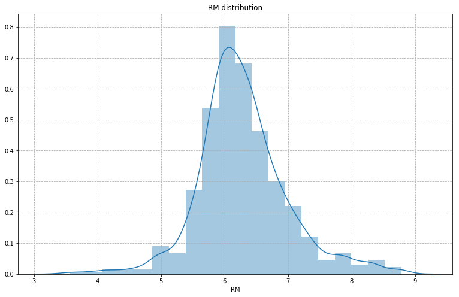


```python
#  Scatter Matrix with KDE
# What is a KDE plot? 
# kernel density estimate - Probability density function

pd.plotting.scatter_matrix(df, figsize=(20, 20), diagonal='kde')
plt.show()
```


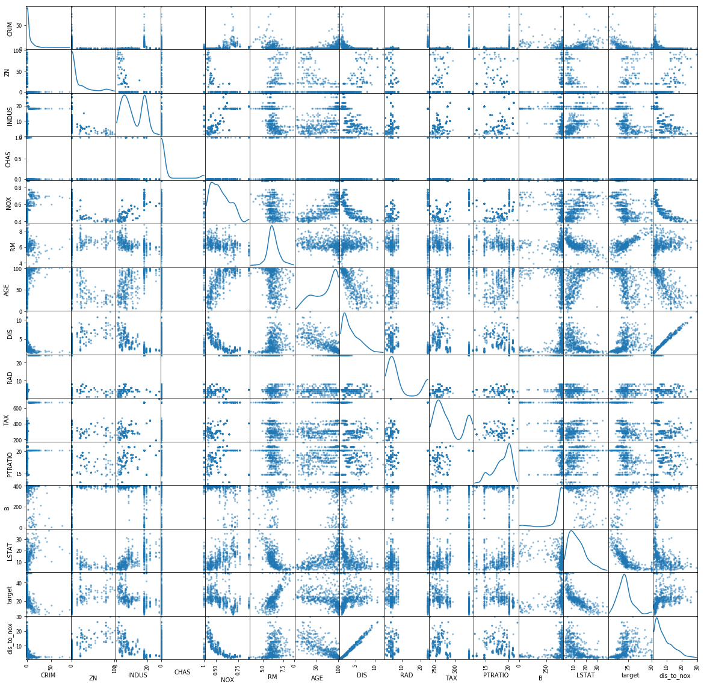


```python
# correlation matrix plot
corr = df.corr()

plt.figure(figsize=(13, 8))
sns.heatmap(data=np.abs(corr), cmap=sns.color_palette('Purples'), annot=True)
plt.title("Absolute Correlation Heatmap", fontsize=16)
plt.show()
```


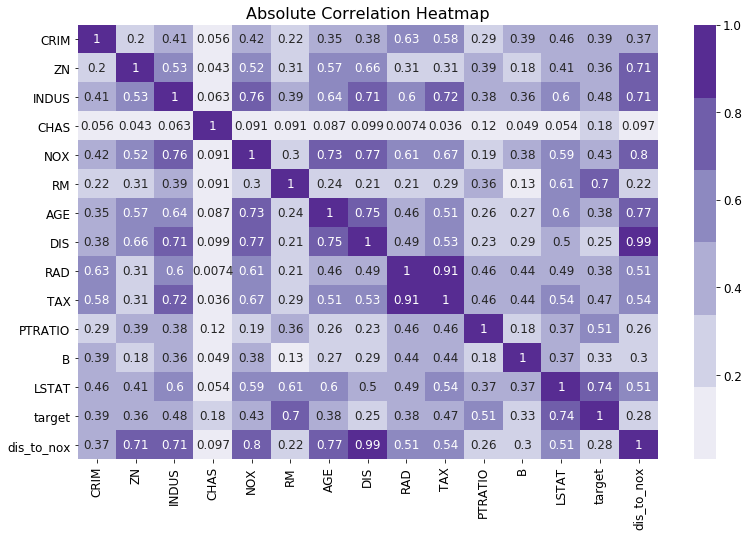


```python
corr[corr > 0.50]
```


<div>
<style scoped>
    .dataframe tbody tr th:only-of-type {
        vertical-align: middle;
    }

    .dataframe tbody tr th {
        vertical-align: top;
    }

    .dataframe thead th {
        text-align: right;
    }
</style>
<table border="1" class="dataframe">
  <thead>
    <tr style="text-align: right;">
      <th></th>
      <th>CRIM</th>
      <th>ZN</th>
      <th>INDUS</th>
      <th>CHAS</th>
      <th>NOX</th>
      <th>RM</th>
      <th>AGE</th>
      <th>DIS</th>
      <th>RAD</th>
      <th>TAX</th>
      <th>PTRATIO</th>
      <th>B</th>
      <th>LSTAT</th>
      <th>target</th>
      <th>dis_to_nox</th>
    </tr>
  </thead>
  <tbody>
    <tr>
      <td>CRIM</td>
      <td>1.000000</td>
      <td>NaN</td>
      <td>NaN</td>
      <td>NaN</td>
      <td>NaN</td>
      <td>NaN</td>
      <td>NaN</td>
      <td>NaN</td>
      <td>0.625505</td>
      <td>0.582764</td>
      <td>NaN</td>
      <td>NaN</td>
      <td>NaN</td>
      <td>NaN</td>
      <td>NaN</td>
    </tr>
    <tr>
      <td>ZN</td>
      <td>NaN</td>
      <td>1.000000</td>
      <td>NaN</td>
      <td>NaN</td>
      <td>NaN</td>
      <td>NaN</td>
      <td>NaN</td>
      <td>0.664408</td>
      <td>NaN</td>
      <td>NaN</td>
      <td>NaN</td>
      <td>NaN</td>
      <td>NaN</td>
      <td>NaN</td>
      <td>0.709858</td>
    </tr>
    <tr>
      <td>INDUS</td>
      <td>NaN</td>
      <td>NaN</td>
      <td>1.000000</td>
      <td>NaN</td>
      <td>0.763651</td>
      <td>NaN</td>
      <td>0.644779</td>
      <td>NaN</td>
      <td>0.595129</td>
      <td>0.720760</td>
      <td>NaN</td>
      <td>NaN</td>
      <td>0.603800</td>
      <td>NaN</td>
      <td>NaN</td>
    </tr>
    <tr>
      <td>CHAS</td>
      <td>NaN</td>
      <td>NaN</td>
      <td>NaN</td>
      <td>1.0</td>
      <td>NaN</td>
      <td>NaN</td>
      <td>NaN</td>
      <td>NaN</td>
      <td>NaN</td>
      <td>NaN</td>
      <td>NaN</td>
      <td>NaN</td>
      <td>NaN</td>
      <td>NaN</td>
      <td>NaN</td>
    </tr>
    <tr>
      <td>NOX</td>
      <td>NaN</td>
      <td>NaN</td>
      <td>0.763651</td>
      <td>NaN</td>
      <td>1.000000</td>
      <td>NaN</td>
      <td>0.731470</td>
      <td>NaN</td>
      <td>0.611441</td>
      <td>0.668023</td>
      <td>NaN</td>
      <td>NaN</td>
      <td>0.590879</td>
      <td>NaN</td>
      <td>NaN</td>
    </tr>
    <tr>
      <td>RM</td>
      <td>NaN</td>
      <td>NaN</td>
      <td>NaN</td>
      <td>NaN</td>
      <td>NaN</td>
      <td>1.00000</td>
      <td>NaN</td>
      <td>NaN</td>
      <td>NaN</td>
      <td>NaN</td>
      <td>NaN</td>
      <td>NaN</td>
      <td>NaN</td>
      <td>0.69536</td>
      <td>NaN</td>
    </tr>
    <tr>
      <td>AGE</td>
      <td>NaN</td>
      <td>NaN</td>
      <td>0.644779</td>
      <td>NaN</td>
      <td>0.731470</td>
      <td>NaN</td>
      <td>1.000000</td>
      <td>NaN</td>
      <td>NaN</td>
      <td>0.506456</td>
      <td>NaN</td>
      <td>NaN</td>
      <td>0.602339</td>
      <td>NaN</td>
      <td>NaN</td>
    </tr>
    <tr>
      <td>DIS</td>
      <td>NaN</td>
      <td>0.664408</td>
      <td>NaN</td>
      <td>NaN</td>
      <td>NaN</td>
      <td>NaN</td>
      <td>NaN</td>
      <td>1.000000</td>
      <td>NaN</td>
      <td>NaN</td>
      <td>NaN</td>
      <td>NaN</td>
      <td>NaN</td>
      <td>NaN</td>
      <td>0.992012</td>
    </tr>
    <tr>
      <td>RAD</td>
      <td>0.625505</td>
      <td>NaN</td>
      <td>0.595129</td>
      <td>NaN</td>
      <td>0.611441</td>
      <td>NaN</td>
      <td>NaN</td>
      <td>NaN</td>
      <td>1.000000</td>
      <td>0.910228</td>
      <td>NaN</td>
      <td>NaN</td>
      <td>NaN</td>
      <td>NaN</td>
      <td>NaN</td>
    </tr>
    <tr>
      <td>TAX</td>
      <td>0.582764</td>
      <td>NaN</td>
      <td>0.720760</td>
      <td>NaN</td>
      <td>0.668023</td>
      <td>NaN</td>
      <td>0.506456</td>
      <td>NaN</td>
      <td>0.910228</td>
      <td>1.000000</td>
      <td>NaN</td>
      <td>NaN</td>
      <td>0.543993</td>
      <td>NaN</td>
      <td>NaN</td>
    </tr>
    <tr>
      <td>PTRATIO</td>
      <td>NaN</td>
      <td>NaN</td>
      <td>NaN</td>
      <td>NaN</td>
      <td>NaN</td>
      <td>NaN</td>
      <td>NaN</td>
      <td>NaN</td>
      <td>NaN</td>
      <td>NaN</td>
      <td>1.0</td>
      <td>NaN</td>
      <td>NaN</td>
      <td>NaN</td>
      <td>NaN</td>
    </tr>
    <tr>
      <td>B</td>
      <td>NaN</td>
      <td>NaN</td>
      <td>NaN</td>
      <td>NaN</td>
      <td>NaN</td>
      <td>NaN</td>
      <td>NaN</td>
      <td>NaN</td>
      <td>NaN</td>
      <td>NaN</td>
      <td>NaN</td>
      <td>1.0</td>
      <td>NaN</td>
      <td>NaN</td>
      <td>NaN</td>
    </tr>
    <tr>
      <td>LSTAT</td>
      <td>NaN</td>
      <td>NaN</td>
      <td>0.603800</td>
      <td>NaN</td>
      <td>0.590879</td>
      <td>NaN</td>
      <td>0.602339</td>
      <td>NaN</td>
      <td>NaN</td>
      <td>0.543993</td>
      <td>NaN</td>
      <td>NaN</td>
      <td>1.000000</td>
      <td>NaN</td>
      <td>NaN</td>
    </tr>
    <tr>
      <td>target</td>
      <td>NaN</td>
      <td>NaN</td>
      <td>NaN</td>
      <td>NaN</td>
      <td>NaN</td>
      <td>0.69536</td>
      <td>NaN</td>
      <td>NaN</td>
      <td>NaN</td>
      <td>NaN</td>
      <td>NaN</td>
      <td>NaN</td>
      <td>NaN</td>
      <td>1.00000</td>
      <td>NaN</td>
    </tr>
    <tr>
      <td>dis_to_nox</td>
      <td>NaN</td>
      <td>0.709858</td>
      <td>NaN</td>
      <td>NaN</td>
      <td>NaN</td>
      <td>NaN</td>
      <td>NaN</td>
      <td>0.992012</td>
      <td>NaN</td>
      <td>NaN</td>
      <td>NaN</td>
      <td>NaN</td>
      <td>NaN</td>
      <td>NaN</td>
      <td>1.000000</td>
    </tr>
  </tbody>
</table>
</div>


```python
# correlation matrix with conditional of 0.50

def plot_corr_heat_map(df, threshold=0.50):
    # creating a correlation of absolute values
    corr = df.corr().abs()
    # values of correlation matrix that are above threshold
    corr_sliced = corr[corr>threshold]
    
    # creating a figure with figize of (13, 8)
    plt.figure(figsize=(13, 8))
    
    # creating a seaborn heatmap 
    # data is coming from corr_sliced with a purple color palette
    # annot=True adds the heatmap values to the heatmap
    sns.heatmap(data=corr_sliced, cmap=sns.color_palette('Purples'), annot=True)
    
    # Assigning a title to the plot and threshold is assigned to passed in variable
    plt.title(f"Absolute Correlation Heatmap\nThreshold={threshold}", fontsize=16)
    
    # printing our plot
    plt.show()
```


```python
plot_corr_heat_map(df, threshold=0.3)
```


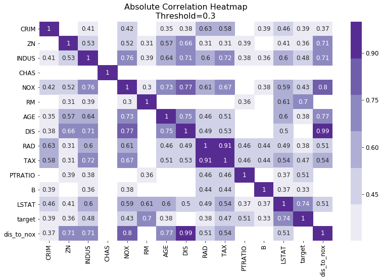


```python
# plot 1 histogram

def plot_hist(df, column_name="RM"):
    tick_fonts = {"fontname": "Chalkduster", "fontsize": 12}
    title_fonts = {"fontname": "Chalkduster", "fontsize": 16}
    plt.figure(figsize=(8, 5))
    plt.grid(zorder=0)
    plt.hist(df[column_name], bins=20, alpha=0.7, zorder=2)
    plt.title(column_name, **title_fonts)
    plt.xticks(**tick_fonts)
    plt.yticks(**tick_fonts)
    plt.show()
```


```python
# plot histograms for all columns
for column in df.columns:
    plot_hist(df, column_name=column)
    print("\n\n")
```


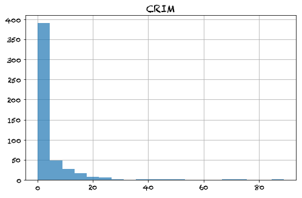


    
    
    


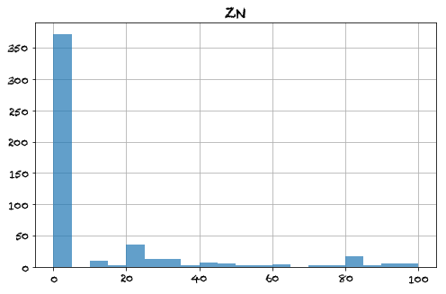


    
    
    


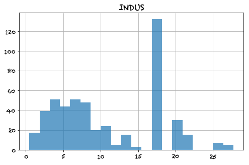


    
    
    


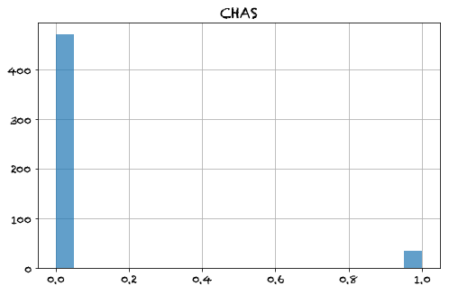


    
    
    


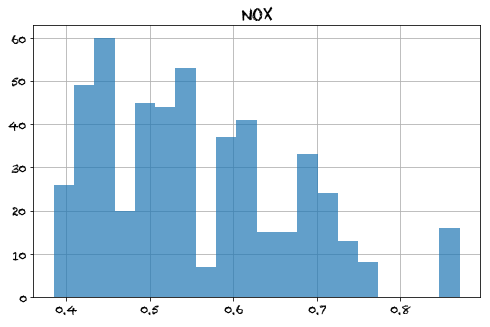


    
    
    


    
    
    


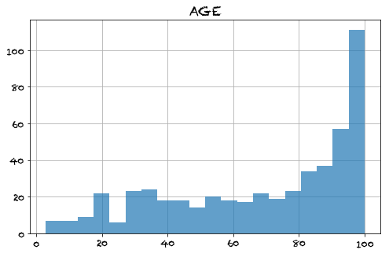


    
    
    


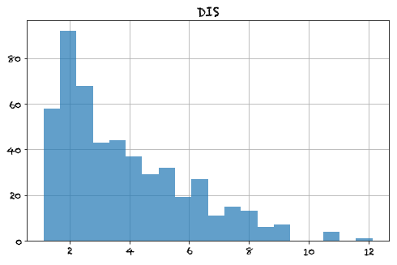


    
    
    


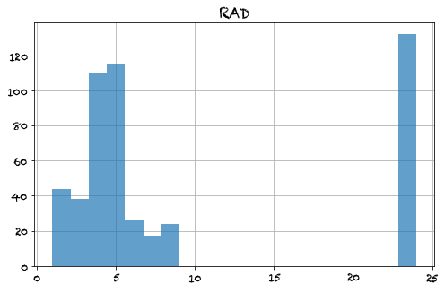


    
    
    


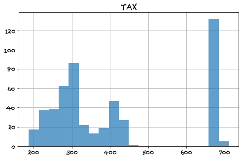


    
    
    


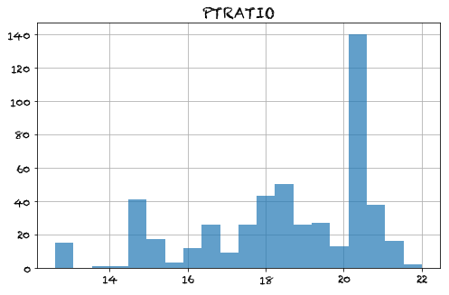


    
    
    


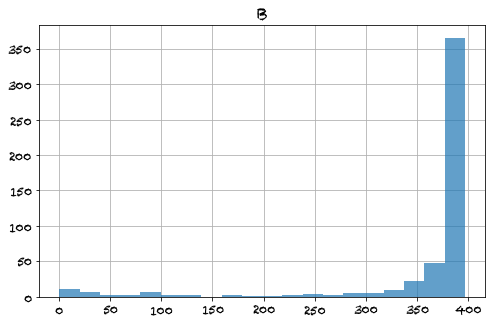


    
    
    


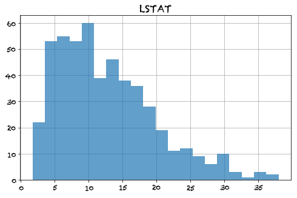


    
    
    


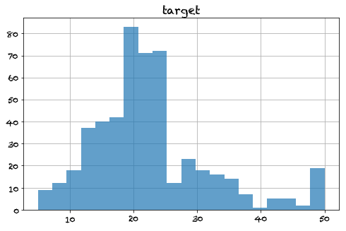


    
    
    


    ---------------------------------------------------------------------------

    KeyboardInterrupt                         Traceback (most recent call last)

    <ipython-input-72-77b9e607c8fa> in <module>
          1 # plot histograms for all columns
          2 for column in df.columns:
    ----> 3     plot_hist(df, column_name=column)
          4     print("\n\n")


    <ipython-input-71-ae1b254414f1> in plot_hist(df, column_name)
          6     plt.figure(figsize=(8, 5))
          7     plt.grid(zorder=0)
    ----> 8     plt.hist(df[column_name], bins=20, alpha=0.7, zorder=2)
          9     plt.title(column_name, **title_fonts)
         10     plt.xticks(**tick_fonts)


    ~/anaconda3/envs/flatiron-env/lib/python3.6/site-packages/matplotlib/pyplot.py in hist(x, bins, range, density, weights, cumulative, bottom, histtype, align, orientation, rwidth, log, color, label, stacked, normed, hold, data, **kwargs)
       3130                       histtype=histtype, align=align, orientation=orientation,
       3131                       rwidth=rwidth, log=log, color=color, label=label,
    -> 3132                       stacked=stacked, normed=normed, data=data, **kwargs)
       3133     finally:
       3134         ax._hold = washold


    ~/anaconda3/envs/flatiron-env/lib/python3.6/site-packages/matplotlib/__init__.py in inner(ax, *args, **kwargs)
       1853                         "the Matplotlib list!)" % (label_namer, func.__name__),
       1854                         RuntimeWarning, stacklevel=2)
    -> 1855             return func(ax, *args, **kwargs)
       1856 
       1857         inner.__doc__ = _add_data_doc(inner.__doc__,


    ~/anaconda3/envs/flatiron-env/lib/python3.6/site-packages/matplotlib/axes/_axes.py in hist(***failed resolving arguments***)
       6604                 patch = _barfunc(bins[:-1]+boffset, height, width,
       6605                                  align='center', log=log,
    -> 6606                                  color=c, **{bottom_kwarg: bottom})
       6607                 patches.append(patch)
       6608                 if stacked:


    ~/anaconda3/envs/flatiron-env/lib/python3.6/site-packages/matplotlib/__init__.py in inner(ax, *args, **kwargs)
       1853                         "the Matplotlib list!)" % (label_namer, func.__name__),
       1854                         RuntimeWarning, stacklevel=2)
    -> 1855             return func(ax, *args, **kwargs)
       1856 
       1857         inner.__doc__ = _add_data_doc(inner.__doc__,


    ~/anaconda3/envs/flatiron-env/lib/python3.6/site-packages/matplotlib/axes/_axes.py in bar(self, *args, **kwargs)
       2326             ymin = max(ymin * 0.9, 1e-100)
       2327             self.dataLim.intervaly = (ymin, ymax)
    -> 2328         self.autoscale_view()
       2329 
       2330         bar_container = BarContainer(patches, errorbar, label=label)


    ~/anaconda3/envs/flatiron-env/lib/python3.6/site-packages/matplotlib/axes/_base.py in autoscale_view(self, tight, scalex, scaley)
       2448             stickies = [artist.sticky_edges for artist in self.get_children()]
       2449             x_stickies = sum([sticky.x for sticky in stickies], [])
    -> 2450             y_stickies = sum([sticky.y for sticky in stickies], [])
       2451             if self.get_xscale().lower() == 'log':
       2452                 x_stickies = [xs for xs in x_stickies if xs > 0]


    KeyboardInterrupt: 


    Error in callback <function flush_figures at 0x1a1d8449d8> (for post_execute):


    ---------------------------------------------------------------------------

    KeyboardInterrupt                         Traceback (most recent call last)

    ~/anaconda3/envs/flatiron-env/lib/python3.6/site-packages/ipykernel/pylab/backend_inline.py in flush_figures()
        115         # ignore the tracking, just draw and close all figures
        116         try:
    --> 117             return show(True)
        118         except Exception as e:
        119             # safely show traceback if in IPython, else raise


    ~/anaconda3/envs/flatiron-env/lib/python3.6/site-packages/ipykernel/pylab/backend_inline.py in show(close, block)
         37             display(
         38                 figure_manager.canvas.figure,
    ---> 39                 metadata=_fetch_figure_metadata(figure_manager.canvas.figure)
         40             )
         41     finally:


    ~/anaconda3/envs/flatiron-env/lib/python3.6/site-packages/IPython/core/display.py in display(include, exclude, metadata, transient, display_id, *objs, **kwargs)
        304             publish_display_data(data=obj, metadata=metadata, **kwargs)
        305         else:
    --> 306             format_dict, md_dict = format(obj, include=include, exclude=exclude)
        307             if not format_dict:
        308                 # nothing to display (e.g. _ipython_display_ took over)


    ~/anaconda3/envs/flatiron-env/lib/python3.6/site-packages/IPython/core/formatters.py in format(self, obj, include, exclude)
        178             md = None
        179             try:
    --> 180                 data = formatter(obj)
        181             except:
        182                 # FIXME: log the exception


    </Users/rafael/anaconda3/envs/flatiron-env/lib/python3.6/site-packages/decorator.py:decorator-gen-9> in __call__(self, obj)


    ~/anaconda3/envs/flatiron-env/lib/python3.6/site-packages/IPython/core/formatters.py in catch_format_error(method, self, *args, **kwargs)
        222     """show traceback on failed format call"""
        223     try:
    --> 224         r = method(self, *args, **kwargs)
        225     except NotImplementedError:
        226         # don't warn on NotImplementedErrors


    ~/anaconda3/envs/flatiron-env/lib/python3.6/site-packages/IPython/core/formatters.py in __call__(self, obj)
        339                 pass
        340             else:
    --> 341                 return printer(obj)
        342             # Finally look for special method names
        343             method = get_real_method(obj, self.print_method)


    ~/anaconda3/envs/flatiron-env/lib/python3.6/site-packages/IPython/core/pylabtools.py in <lambda>(fig)
        242 
        243     if 'png' in formats:
    --> 244         png_formatter.for_type(Figure, lambda fig: print_figure(fig, 'png', **kwargs))
        245     if 'retina' in formats or 'png2x' in formats:
        246         png_formatter.for_type(Figure, lambda fig: retina_figure(fig, **kwargs))


    ~/anaconda3/envs/flatiron-env/lib/python3.6/site-packages/IPython/core/pylabtools.py in print_figure(fig, fmt, bbox_inches, **kwargs)
        126 
        127     bytes_io = BytesIO()
    --> 128     fig.canvas.print_figure(bytes_io, **kw)
        129     data = bytes_io.getvalue()
        130     if fmt == 'svg':


    ~/anaconda3/envs/flatiron-env/lib/python3.6/site-packages/matplotlib/backend_bases.py in print_figure(self, filename, dpi, facecolor, edgecolor, orientation, format, **kwargs)
       2224                         clip_box = a.get_clip_box()
       2225                         if clip_box is not None:
    -> 2226                             bbox = Bbox.intersection(bbox, clip_box)
       2227                         clip_path = a.get_clip_path()
       2228                         if clip_path is not None and bbox is not None:


    ~/anaconda3/envs/flatiron-env/lib/python3.6/site-packages/matplotlib/transforms.py in intersection(bbox1, bbox2)
        758         """
        759         x0 = np.maximum(bbox1.xmin, bbox2.xmin)
    --> 760         x1 = np.minimum(bbox1.xmax, bbox2.xmax)
        761         y0 = np.maximum(bbox1.ymin, bbox2.ymin)
        762         y1 = np.minimum(bbox1.ymax, bbox2.ymax)


    KeyboardInterrupt: 


```python
# plot a distplot 
# plots histogram with PDF (probability density function)

def plot_distplot(df, column_name="RM", add_grid=True):
    tick_fonts = {"fontname": "Chalkduster", "fontsize": 12}
    title_fonts = {"fontname": "Chalkduster", "fontsize": 16}
    
    plt.figure(figsize=(8, 5))
    if add_grid==True:
        plt.grid(zorder=0)
    
    sns.distplot(df[column_name])
    plt.title(column_name, **title_fonts)
    plt.xticks(**tick_fonts)
    plt.yticks(**tick_fonts)
    plt.show()
```


```python
plot_distplot(df, "target")
plot_distplot(df, "target", add_grid=False)
```


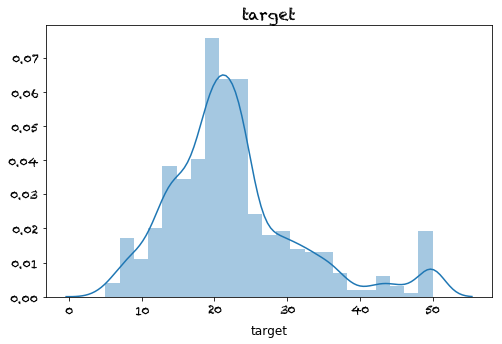


```python
# plot a violin plot
# work best with categories

# plot a distribution of a value across multiple categories

# let's plot target vs the age_types

plt.figure(figsize=(13, 8))
sns.violinplot(x='age_categories', y='target', data=df)
plt.show()
```


### What do we notice about the plot above?
* they look like violins
* no outliers, or not many
* 'low' has high frequencies for target values between 20 and 30
* 'low' has more values closer to the median, because the range is shorter
* as we move from 'low' to 'medium' to 'high' the median target decreases across the groups. 


```python
# plot 2 subplots side by side
fig,ax = plt.subplots(nrows=2, ncols=2, figsize=(8, 8))
plt.subplot(221)
sns.distplot(df['AGE'])
# sns.distplot(df["AGE"], ax=ax[0])

plt.subplot(222)
sns.distplot(df['RM'])

plt.subplot(223)
sns.distplot(df["NOX"])

plt.subplot(224)
sns.distplot(df["CRIM"])


plt.tight_layout()
plt.show()
```


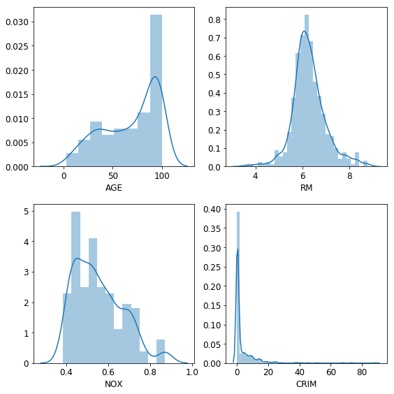


```python
df.columns.shape
```


    (16,)


```python
df.info()
```

    <class 'pandas.core.frame.DataFrame'>
    RangeIndex: 506 entries, 0 to 505
    Data columns (total 16 columns):
    CRIM              506 non-null float64
    ZN                506 non-null float64
    INDUS             506 non-null float64
    CHAS              506 non-null float64
    NOX               506 non-null float64
    RM                506 non-null float64
    AGE               506 non-null float64
    DIS               506 non-null float64
    RAD               506 non-null float64
    TAX               506 non-null float64
    PTRATIO           506 non-null float64
    B                 506 non-null float64
    LSTAT             506 non-null float64
    target            506 non-null float64
    age_categories    506 non-null object
    dis_to_nox        506 non-null float64
    dtypes: float64(15), object(1)
    memory usage: 63.4+ KB


```python
# iteratively plot subplots...spoiler alert, I will use google
# drop age_type since it's a string column

columns = df.drop('age_categories', axis=1).columns
matplotlib.rcParams["font.size"]=14

fig, ax = plt.subplots(ncols=3, nrows=5, figsize=(20, 20))

for index, a in enumerate(ax.flatten()):
    column = columns[index]
    a = sns.distplot(df[column], ax=a)
plt.tight_layout()
plt.show()
```


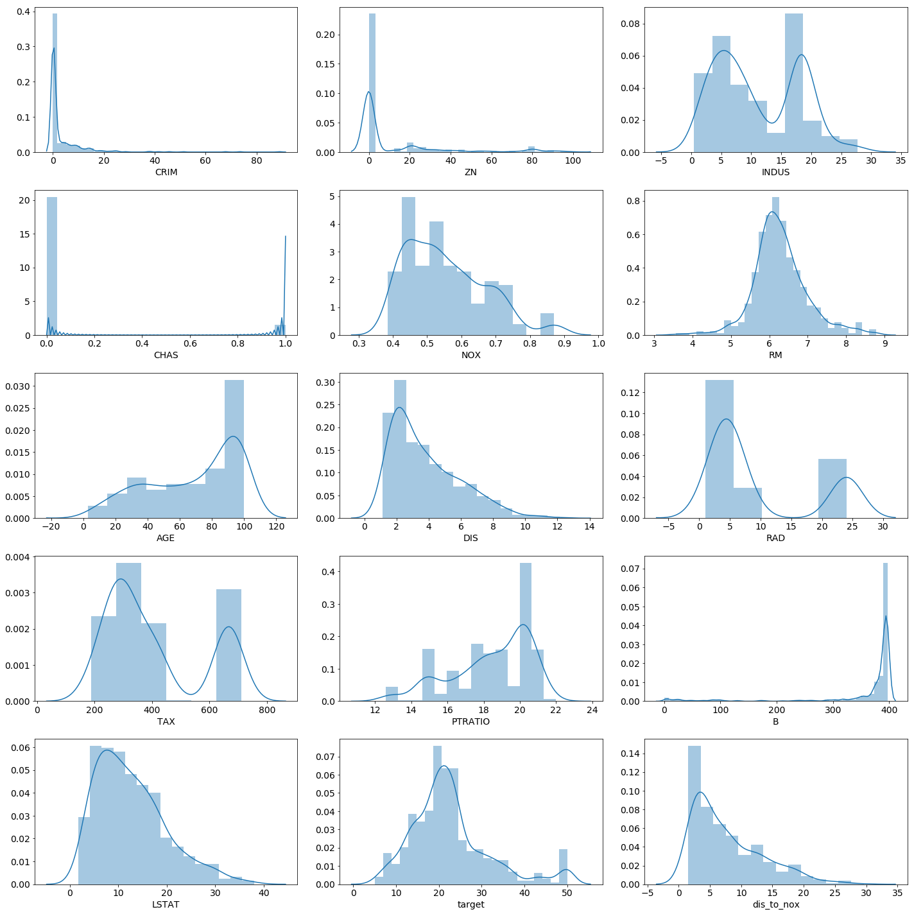


### Assessment / What did we learn? 
* \*args, \*\*kwargs
* subplots in matplotlib
    * basically a big matrix of plots
*


```python

```
