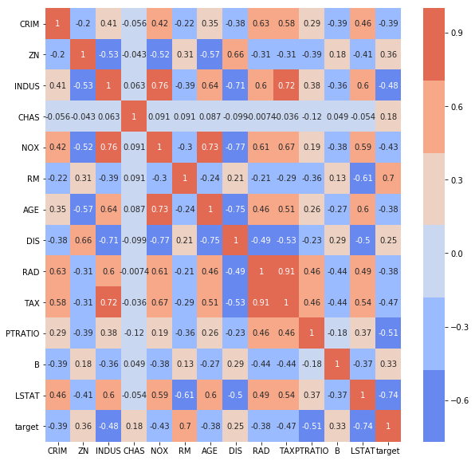
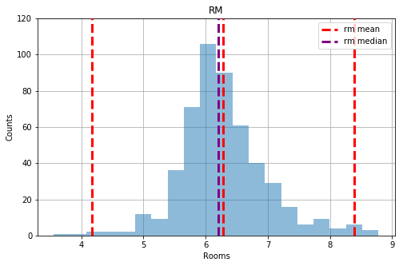
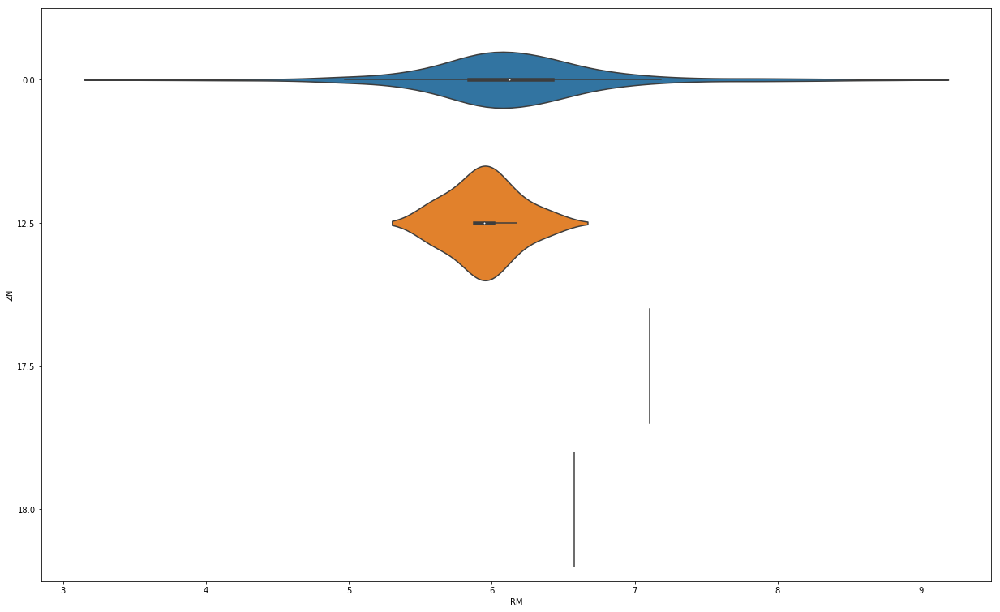
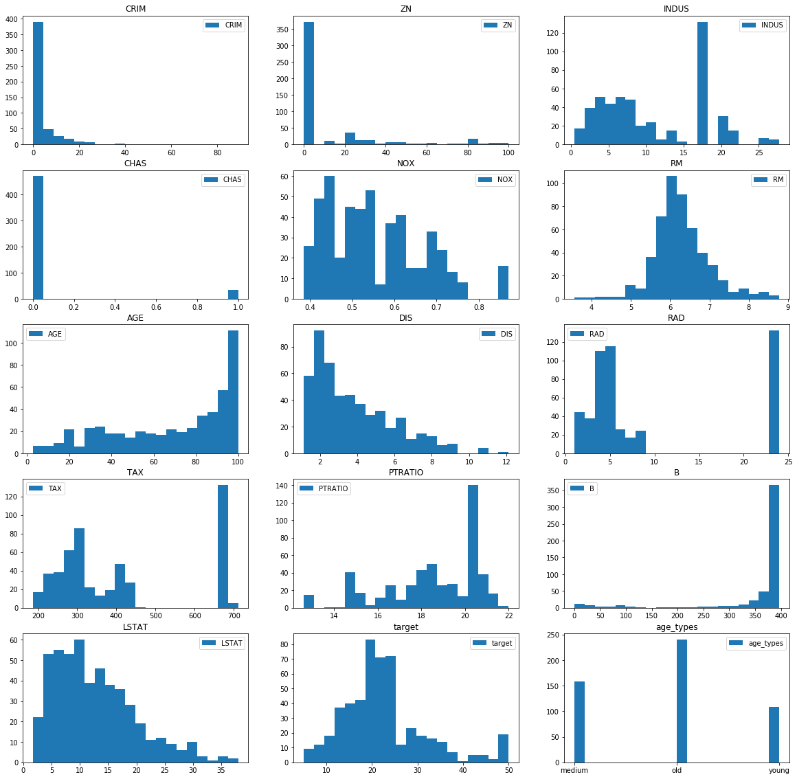

### Questions
* ax objects for subplots
* subplots/subplot what is the difference
* what point is there to use the figure
* dummying

### Objectives
YWBAT 
* build a box plot
* build histograms
* build and interpret violin plots
* add vlines and hlines to boost visualizations

### Outline
* questions
* load in some data or create data
* plotting everything


```python
import pandas as pd
import numpy as np

from sklearn.datasets import load_boston

from pprint import pprint

import matplotlib.pyplot as plt
import seaborn as sns
```


```python
boston = load_boston()
```


```python
data = boston.data
columns = list(boston.feature_names) + ['target']
target = boston.target
```


```python
df = pd.DataFrame(np.column_stack((data, target)), columns=columns)
df.head()
```


<div>
<style scoped>
    .dataframe tbody tr th:only-of-type {
        vertical-align: middle;
    }

    .dataframe tbody tr th {
        vertical-align: top;
    }

    .dataframe thead th {
        text-align: right;
    }
</style>
<table border="1" class="dataframe">
  <thead>
    <tr style="text-align: right;">
      <th></th>
      <th>CRIM</th>
      <th>ZN</th>
      <th>INDUS</th>
      <th>CHAS</th>
      <th>NOX</th>
      <th>RM</th>
      <th>AGE</th>
      <th>DIS</th>
      <th>RAD</th>
      <th>TAX</th>
      <th>PTRATIO</th>
      <th>B</th>
      <th>LSTAT</th>
      <th>target</th>
    </tr>
  </thead>
  <tbody>
    <tr>
      <th>0</th>
      <td>0.00632</td>
      <td>18.0</td>
      <td>2.31</td>
      <td>0.0</td>
      <td>0.538</td>
      <td>6.575</td>
      <td>65.2</td>
      <td>4.0900</td>
      <td>1.0</td>
      <td>296.0</td>
      <td>15.3</td>
      <td>396.90</td>
      <td>4.98</td>
      <td>24.0</td>
    </tr>
    <tr>
      <th>1</th>
      <td>0.02731</td>
      <td>0.0</td>
      <td>7.07</td>
      <td>0.0</td>
      <td>0.469</td>
      <td>6.421</td>
      <td>78.9</td>
      <td>4.9671</td>
      <td>2.0</td>
      <td>242.0</td>
      <td>17.8</td>
      <td>396.90</td>
      <td>9.14</td>
      <td>21.6</td>
    </tr>
    <tr>
      <th>2</th>
      <td>0.02729</td>
      <td>0.0</td>
      <td>7.07</td>
      <td>0.0</td>
      <td>0.469</td>
      <td>7.185</td>
      <td>61.1</td>
      <td>4.9671</td>
      <td>2.0</td>
      <td>242.0</td>
      <td>17.8</td>
      <td>392.83</td>
      <td>4.03</td>
      <td>34.7</td>
    </tr>
    <tr>
      <th>3</th>
      <td>0.03237</td>
      <td>0.0</td>
      <td>2.18</td>
      <td>0.0</td>
      <td>0.458</td>
      <td>6.998</td>
      <td>45.8</td>
      <td>6.0622</td>
      <td>3.0</td>
      <td>222.0</td>
      <td>18.7</td>
      <td>394.63</td>
      <td>2.94</td>
      <td>33.4</td>
    </tr>
    <tr>
      <th>4</th>
      <td>0.06905</td>
      <td>0.0</td>
      <td>2.18</td>
      <td>0.0</td>
      <td>0.458</td>
      <td>7.147</td>
      <td>54.2</td>
      <td>6.0622</td>
      <td>3.0</td>
      <td>222.0</td>
      <td>18.7</td>
      <td>396.90</td>
      <td>5.33</td>
      <td>36.2</td>
    </tr>
  </tbody>
</table>
</div>


```python
age_types = []
for age in df.AGE:
    if age < 40:
        age_types.append('young')
    elif age < 80:
        age_types.append('medium')
    else:
        age_types.append('old')
```


```python
df['age_types'] = age_types
df.head()
```


<div>
<style scoped>
    .dataframe tbody tr th:only-of-type {
        vertical-align: middle;
    }

    .dataframe tbody tr th {
        vertical-align: top;
    }

    .dataframe thead th {
        text-align: right;
    }
</style>
<table border="1" class="dataframe">
  <thead>
    <tr style="text-align: right;">
      <th></th>
      <th>CRIM</th>
      <th>ZN</th>
      <th>INDUS</th>
      <th>CHAS</th>
      <th>NOX</th>
      <th>RM</th>
      <th>AGE</th>
      <th>DIS</th>
      <th>RAD</th>
      <th>TAX</th>
      <th>PTRATIO</th>
      <th>B</th>
      <th>LSTAT</th>
      <th>target</th>
      <th>age_types</th>
    </tr>
  </thead>
  <tbody>
    <tr>
      <th>0</th>
      <td>0.00632</td>
      <td>18.0</td>
      <td>2.31</td>
      <td>0.0</td>
      <td>0.538</td>
      <td>6.575</td>
      <td>65.2</td>
      <td>4.0900</td>
      <td>1.0</td>
      <td>296.0</td>
      <td>15.3</td>
      <td>396.90</td>
      <td>4.98</td>
      <td>24.0</td>
      <td>medium</td>
    </tr>
    <tr>
      <th>1</th>
      <td>0.02731</td>
      <td>0.0</td>
      <td>7.07</td>
      <td>0.0</td>
      <td>0.469</td>
      <td>6.421</td>
      <td>78.9</td>
      <td>4.9671</td>
      <td>2.0</td>
      <td>242.0</td>
      <td>17.8</td>
      <td>396.90</td>
      <td>9.14</td>
      <td>21.6</td>
      <td>medium</td>
    </tr>
    <tr>
      <th>2</th>
      <td>0.02729</td>
      <td>0.0</td>
      <td>7.07</td>
      <td>0.0</td>
      <td>0.469</td>
      <td>7.185</td>
      <td>61.1</td>
      <td>4.9671</td>
      <td>2.0</td>
      <td>242.0</td>
      <td>17.8</td>
      <td>392.83</td>
      <td>4.03</td>
      <td>34.7</td>
      <td>medium</td>
    </tr>
    <tr>
      <th>3</th>
      <td>0.03237</td>
      <td>0.0</td>
      <td>2.18</td>
      <td>0.0</td>
      <td>0.458</td>
      <td>6.998</td>
      <td>45.8</td>
      <td>6.0622</td>
      <td>3.0</td>
      <td>222.0</td>
      <td>18.7</td>
      <td>394.63</td>
      <td>2.94</td>
      <td>33.4</td>
      <td>medium</td>
    </tr>
    <tr>
      <th>4</th>
      <td>0.06905</td>
      <td>0.0</td>
      <td>2.18</td>
      <td>0.0</td>
      <td>0.458</td>
      <td>7.147</td>
      <td>54.2</td>
      <td>6.0622</td>
      <td>3.0</td>
      <td>222.0</td>
      <td>18.7</td>
      <td>396.90</td>
      <td>5.33</td>
      <td>36.2</td>
      <td>medium</td>
    </tr>
  </tbody>
</table>
</div>


```python
df.CHAS.unique()
```


    array([0., 1.])


```python
pprint(boston.DESCR)
```

    ('.. _boston_dataset:\n'
     '\n'
     'Boston house prices dataset\n'
     '---------------------------\n'
     '\n'
     '**Data Set Characteristics:**  \n'
     '\n'
     '    :Number of Instances: 506 \n'
     '\n'
     '    :Number of Attributes: 13 numeric/categorical predictive. Median Value '
     '(attribute 14) is usually the target.\n'
     '\n'
     '    :Attribute Information (in order):\n'
     '        - CRIM     per capita crime rate by town\n'
     '        - ZN       proportion of residential land zoned for lots over 25,000 '
     'sq.ft.\n'
     '        - INDUS    proportion of non-retail business acres per town\n'
     '        - CHAS     Charles River dummy variable (= 1 if tract bounds river; '
     '0 otherwise)\n'
     '        - NOX      nitric oxides concentration (parts per 10 million)\n'
     '        - RM       average number of rooms per dwelling\n'
     '        - AGE      proportion of owner-occupied units built prior to 1940\n'
     '        - DIS      weighted distances to five Boston employment centres\n'
     '        - RAD      index of accessibility to radial highways\n'
     '        - TAX      full-value property-tax rate per $10,000\n'
     '        - PTRATIO  pupil-teacher ratio by town\n'
     '        - B        1000(Bk - 0.63)^2 where Bk is the proportion of blacks by '
     'town\n'
     '        - LSTAT    % lower status of the population\n'
     "        - MEDV     Median value of owner-occupied homes in $1000's\n"
     '\n'
     '    :Missing Attribute Values: None\n'
     '\n'
     '    :Creator: Harrison, D. and Rubinfeld, D.L.\n'
     '\n'
     'This is a copy of UCI ML housing dataset.\n'
     'https://archive.ics.uci.edu/ml/machine-learning-databases/housing/\n'
     '\n'
     '\n'
     'This dataset was taken from the StatLib library which is maintained at '
     'Carnegie Mellon University.\n'
     '\n'
     "The Boston house-price data of Harrison, D. and Rubinfeld, D.L. 'Hedonic\n"
     "prices and the demand for clean air', J. Environ. Economics & Management,\n"
     "vol.5, 81-102, 1978.   Used in Belsley, Kuh & Welsch, 'Regression "
     'diagnostics\n'
     "...', Wiley, 1980.   N.B. Various transformations are used in the table on\n"
     'pages 244-261 of the latter.\n'
     '\n'
     'The Boston house-price data has been used in many machine learning papers '
     'that address regression\n'
     'problems.   \n'
     '     \n'
     '.. topic:: References\n'
     '\n'
     "   - Belsley, Kuh & Welsch, 'Regression diagnostics: Identifying Influential "
     "Data and Sources of Collinearity', Wiley, 1980. 244-261.\n"
     '   - Quinlan,R. (1993). Combining Instance-Based and Model-Based Learning. '
     'In Proceedings on the Tenth International Conference of Machine Learning, '
     '236-243, University of Massachusetts, Amherst. Morgan Kaufmann.\n')


```python
### Scatter Matrix
pd.plotting.scatter_matrix(df, figsize=(20, 20))
plt.show()
```


```python
corr = df.corr()
plt.figure(figsize=(10, 10))
sns.heatmap(corr, annot=True, fmt='0.2g', cmap=sns.color_palette("coolwarm"))
plt.show()
```





```python
corr2 = corr[abs(corr) > .50]
plt.figure(figsize=(10, 10))
sns.heatmap(corr2, annot=True, fmt='0.2g', cmap=sns.color_palette("coolwarm"))
plt.show()
```


```python
df.shape
```


    (506, 14)


```python
# plot 1 histogram
plt.figure(figsize=(8, 5))
plt.hist(df.RM, bins=20, zorder=2, alpha=0.5)
plt.vlines(x=df.RM.mean(), ymin=0, ymax=120, zorder=3, colors='r', linestyles='--', linewidth=3, label='rm mean')
plt.vlines(x=df.RM.mean() + 3*df.RM.std(), ymin=0, ymax=120, zorder=3, colors='r', linestyles='--', linewidth=3)
plt.vlines(x=df.RM.mean() - 3*df.RM.std(), ymin=0, ymax=120, zorder=3, colors='r', linestyles='--', linewidth=3)
plt.vlines(x=df.RM.median(), ymin=0, ymax=120, zorder=3, colors='purple', linestyles='--', linewidth=3, label='rm median')
plt.ylim([0, 120])
plt.xlabel("Rooms")
plt.ylabel("Counts")
plt.title('RM')
plt.legend()
plt.grid(zorder=0)
plt.show()
```





```python
plt.figure(figsize=(13, 8))
plt.grid(linestyle='dashed')
plt.title("RM distribution")
sns.distplot(df.RM, bins=20)
plt.show()
```


```python
plt.figure(figsize=(21, 13))
sns.violinplot(x='RM', y='ZN', data=df[df.ZN<20], orient='h')
```


    <matplotlib.axes._subplots.AxesSubplot at 0x1a24fb3160>





```python
plt.subplots(nrows=1, ncols=2, figsize=(13, 8))

# subplot 1
plt.subplot(121)
plt.hist(df.RM, bins=20)
plt.title('RM')

# subplot 2
plt.subplot(122)
plt.hist(df.ZN, bins=20)
plt.title("ZN")

plt.tight_layout()
plt.show()
```


```python
df.columns[0]
```


    'CRIM'


```python
this, that = plt.subplots(5, 3, figsize=(20, 20))

for index, ax in enumerate(that.flatten()):
    column = df.columns[index]
    ax.hist(df[column], bins=20)
    ax.set_title(column)
    ax.legend()
plt.show()
```





### Assessment / What did we learn? 
* flatten method -> flattens matrices to 1d
* scatter matrices and heatmaps
* violin plots
* how to use universal attributes for plotting; plt.xlabel(), plt.ylims()
* kwargs -> meaning
